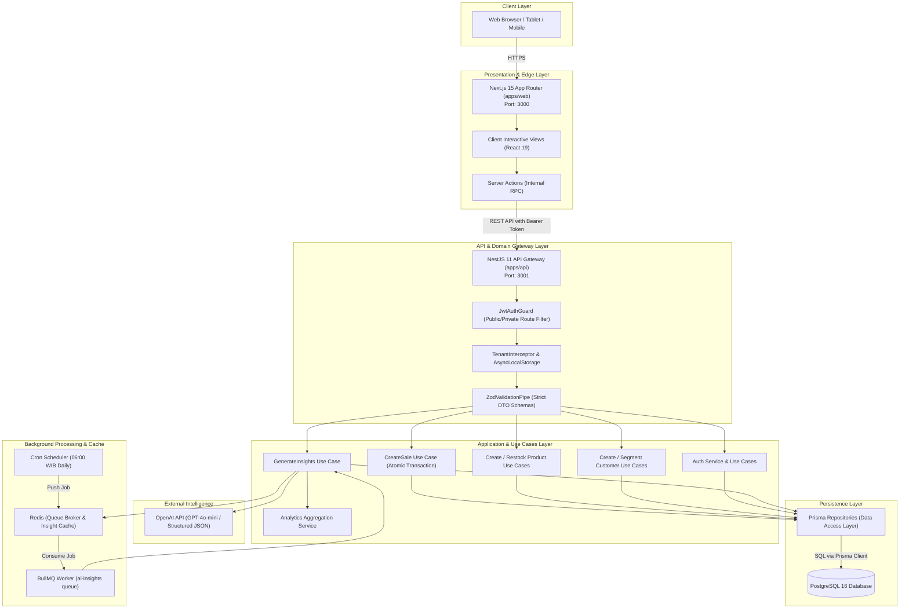
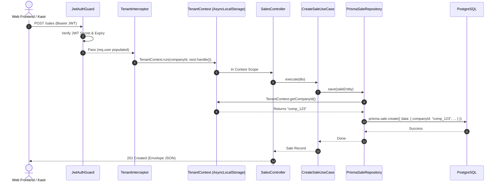
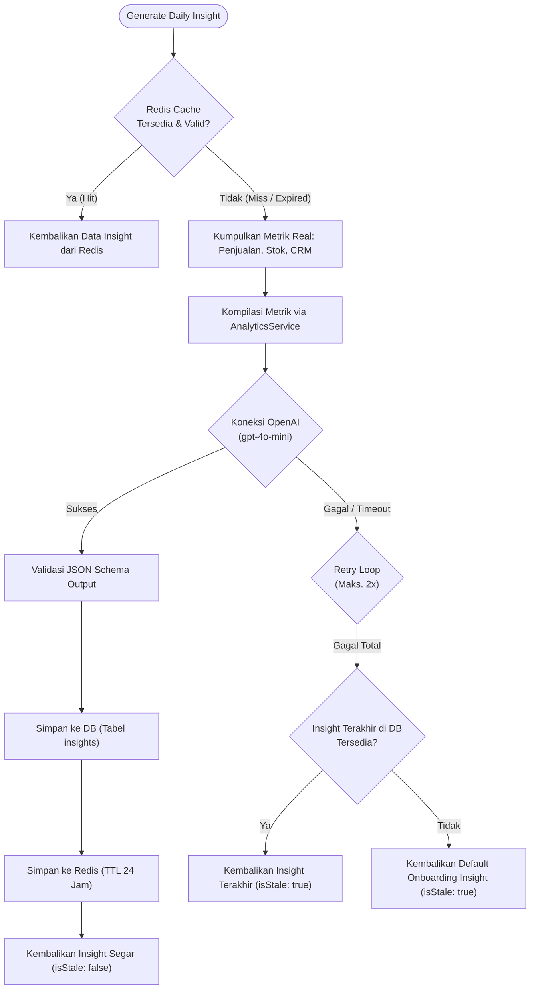
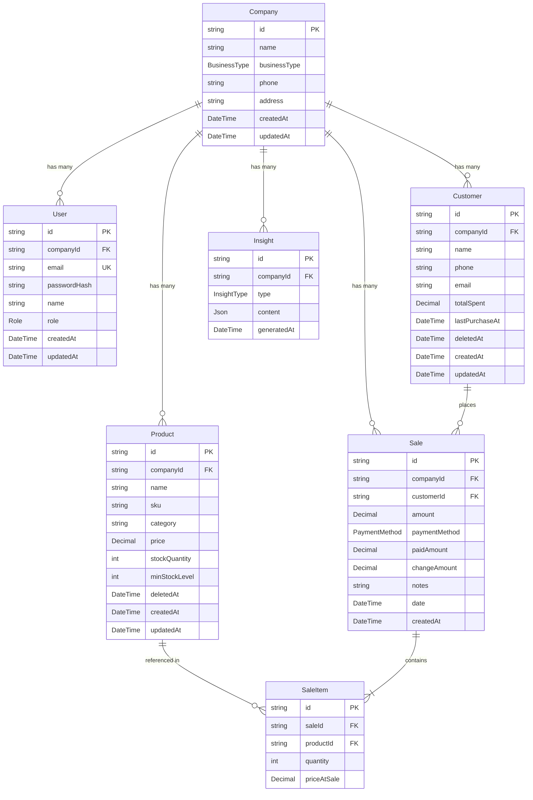

# System Architecture Document
## AI COO — Technical & Enterprise Architecture Specification

---

## 1. Executive System Architecture Overview

**AI COO** mengadopsi pola **Modular Monorepo** berbasis **Clean Architecture** (Domain-Driven Design principles) di sisi backend (NestJS 11) dan **Modern Hybrid Architecture** (Server Components + Server Actions + Client Views) di sisi frontend (Next.js 15).

Sistem ini didesain untuk mencapai tiga tujuan teknis utama:
1. **Strict Multi-Tenancy**: Pemisahan data absolut antartenant (`Company`) dengan *zero cross-tenant leakage* menggunakan *AsyncLocalStorage Context*.
2. **Deterministic Reliability**: Transaksi kasir POS atomik (*ACID compliant*) dengan pengurangan stok real-time.
3. **Resilient AI Pipeline**: Analisis operasional berbasis LLM yang terlindung dari *external service failure* menggunakan *multi-tiered caching & fallback strategy*.



---

## 2. Monorepo Structure & Dependency Topology

Proyek diatur menggunakan **pnpm workspaces** yang diorkestrasi oleh **Turborepo** (`turbo.json`) untuk caching build, linting paralel, dan pengujian otomatis.

```
ai-coo/
├── apps/
│   ├── api/                     # Backend API (NestJS 11)
│   │   ├── src/
│   │   │   ├── common/          # Interceptors, Guards, Pipes, Context, Types
│   │   │   ├── modules/         # Domain Modules (Auth, Companies, Customers, Products, Sales, AI, Health)
│   │   │   └── main.ts          # Application Bootstrap & Swagger Setup
│   │   └── test/                # E2E Isolation & Integration Tests
│   └── web/                     # Frontend Application (Next.js 15)
│       └── src/
│           ├── app/             # App Router Pages & Layouts
│           │   ├── (auth)/      # Login & Register Pages
│           │   ├── (dashboard)/ # Authenticated Dashboard Shell & Views
│           │   └── actions/     # Next.js Server Actions (RPC Bridge to API)
│           ├── components/      # UI Component Library (Card, Button, Input, Sidebar)
│           └── lib/             # API Client, Utilities, Env Config
├── packages/
│   ├── database/                # Prisma ORM Schema, Migrations, Client
│   ├── shared-types/            # Canonical DTOs, Enums, Interfaces (.d.ts bundle)
│   ├── validation/              # Shared Zod Schemas (.d.ts bundle)
│   └── eslint-config/           # Unified ESLint 9 Flat Config rules
├── turbo.json                   # Build, Lint, Test Pipeline Caching Config
├── pnpm-workspace.yaml          # Workspace definitions
└── docker-compose.yml           # PostgreSQL & Redis infrastructure
```

### Dependency Graph Matrix
- `@ai-coo/shared-types` $\leftarrow$ Diimpor oleh: `@ai-coo/validation`, `@ai-coo/api`, `@ai-coo/web`.
- `@ai-coo/validation` $\leftarrow$ Diimpor oleh: `@ai-coo/api`, `@ai-coo/web`.
- `@ai-coo/database` $\leftarrow$ Diimpor oleh: `@ai-coo/api`.

---

## 3. Backend Architecture: Clean Architecture (NestJS 11)

Modul bisnis utama (`products`, `customers`, `sales`, `ai-insights`) diimplementasikan mengikuti prinsip **Clean Architecture**:

```
[ Domain Layer ]  <--  [ Application Layer ]  <--  [ Presentation Layer ]
  (Entities)             (Use Cases / Svcs)         (Controllers & DTOs)
       ^                         ^
       |                         |
[ Infrastructure Layer ] --------+
  (Prisma Repos, BullMQ, Redis, OpenAI)
```

### 3.1 Domain Layer
- **Entities**: Objek domain murni tanpa ketergantungan framework.
  - [`Product`](file:///d:/MY%20CODE/ANTIGRAVITY/01-production/ai-coo/apps/api/src/modules/products/domain/entities/product.entity.ts): Mengenkapsulasi status stok (`isLowStock()`, `isCriticalStock()`), aturan pengurangan stok, dan restock.
  - [`Customer`](file:///d:/MY%20CODE/ANTIGRAVITY/01-production/ai-coo/apps/api/src/modules/customers/domain/entities/customer.entity.ts): Mengenkapsulasi perhitungan akumulasi pengeluaran dan status keaktifan.
  - [`Sale`](file:///d:/MY%20CODE/ANTIGRAVITY/01-production/ai-coo/apps/api/src/modules/sales/domain/entities/sale.entity.ts): Mengenkapsulasi entitas penjualan dan validasi kuantitas item.
- **Repository Interfaces**: Deklarasi kontrak abstraksi (e.g. [`IProductRepository`](file:///d:/MY%20CODE/ANTIGRAVITY/01-production/ai-coo/apps/api/src/modules/products/domain/repositories/product.repository.interface.ts), [`ICustomerRepository`](file:///d:/MY%20CODE/ANTIGRAVITY/01-production/ai-coo/apps/api/src/modules/customers/domain/repositories/customer.repository.interface.ts), [`ISaleRepository`](file:///d:/MY%20CODE/ANTIGRAVITY/01-production/ai-coo/apps/api/src/modules/sales/domain/repositories/sale.repository.interface.ts), [`IInsightRepository`](file:///d:/MY%20CODE/ANTIGRAVITY/01-production/ai-coo/apps/api/src/modules/ai-insights/domain/repositories/insight.repository.interface.ts)).

### 3.2 Application Layer (Use Cases & Interactors)
- Menerapkan alur bisnis tanpa mengetahui detail database:
  - [`CreateProductUseCase`](file:///d:/MY%20CODE/ANTIGRAVITY/01-production/ai-coo/apps/api/src/modules/products/application/use-cases/create-product.use-case.ts), [`RestockProductUseCase`](file:///d:/MY%20CODE/ANTIGRAVITY/01-production/ai-coo/apps/api/src/modules/products/application/use-cases/restock-product.use-case.ts).
  - [`CreateCustomerUseCase`](file:///d:/MY%20CODE/ANTIGRAVITY/01-production/ai-coo/apps/api/src/modules/customers/application/use-cases/create-customer.use-case.ts).
  - [`CreateSaleUseCase`](file:///d:/MY%20CODE/ANTIGRAVITY/01-production/ai-coo/apps/api/src/modules/sales/application/use-cases/create-sale.use-case.ts).
  - [`GenerateInsightsUseCase`](file:///d:/MY%20CODE/ANTIGRAVITY/01-production/ai-coo/apps/api/src/modules/ai-insights/application/use-cases/generate-insights.use-case.ts): Mengkoordinasikan kalkulasi metrik lokal, caching Redis, prompt engineering, dan fallback.
  - [`AnalyticsService`](file:///d:/MY%20CODE/ANTIGRAVITY/01-production/ai-coo/apps/api/src/modules/ai-insights/application/services/analytics.service.ts): Mesin komputasi statistik murni (Revenue 7d vs 14d, Average Order Value, Customer Churn Count, Fastest Moving SKU).

### 3.3 Infrastructure Layer
- **Prisma Repositories**: Mengimplementasikan kontrak repositori domain menggunakan Prisma Client, menjamin query selalu tersaring berdasarkan `TenantContext.getCompanyId()`.
- **OpenAiProvider**: Wrapper API OpenAI menggunakan model `gpt-4o-mini` dengan parameter `response_format: { type: 'json_schema', strict: true }`.
- **AiInsightsProcessor (BullMQ)**: Worker antrean asynchronous yang memproses job terjadwal `generate-all-insights`.

### 3.4 Presentation Layer
- **Controllers**: Menerima request HTTP, memvalidasi DTO via Zod, dan mendelegasikan ke use case yang sesuai.
- **Filters & Interceptors**:
  - `TenantInterceptor`: Memvalidasi payload JWT dan menginisialisasi context tenant via `AsyncLocalStorage`.
  - `JwtAuthGuard`: Proteksi rute global secara default; rute publik dianotasi dengan `@Public()`.
  - `ZodValidationPipe`: Validasi skema Zod secara otomatis dengan error mapping terstruktur.

---

## 4. Multi-Tenancy & Isolation Architecture

Sistem menjamin **Multi-Tenancy Tingkat Tinggi (Shared Database, Shared Schema, Strict Logical Isolation)**.



### AsyncLocalStorage Mechanism
Diimplementasikan dalam [`TenantContext`](file:///d:/MY%20CODE/ANTIGRAVITY/01-production/ai-coo/apps/api/src/common/context/tenant-context.ts):
```typescript
export class TenantContext {
  private static readonly storage = new AsyncLocalStorage<{ companyId: string }>();

  static run<T>(companyId: string, fn: () => Promise<T>): Promise<T> {
    return this.storage.run({ companyId }, fn);
  }

  static getCompanyId(): string {
    const store = this.storage.getStore();
    if (!store?.companyId) {
      throw new UnauthorizedException('Tenant context is missing or invalid');
    }
    return store.companyId;
  }
}
```
**Keunggulan**: Mengeliminasi risiko kelalaian developer meneruskan `companyId` secara manual di setiap parameter fungsi internal. Jika ada repositori mencoba mengakses database tanpa context, eksekusi langsung gagal (*fail-fast*).

---

## 5. AI Insights & Multi-Tier Resiliency Architecture



### Multi-Tier Fallback Policy:
1. **Tier 1 (Hot Cache)**: Redis In-Memory Key `insights:{companyId}:latest` (TTL 86.400 detik / 24 jam).
2. **Tier 2 (Fresh AI Generation)**: OpenAI GPT-4o-mini dengan prompt parameter terverifikasi (bebas halusinasi metrik).
3. **Tier 3 (Persistent Database History)**: Query database PostgreSQL pada tabel `insights` terurut tanggal terbaru (`generatedAt desc`).
4. **Tier 4 (Hardcoded Intelligent Fallback)**: Template operasional bisnis UMKM default terstruktur dengan bendera `isStale: true` sehingga antarmuka pengguna tidak pernah *blank* atau *crash*.

---

## 6. Database Architecture & Relational Model



### Indeks Kinerja Kunci
- `customers([companyId, deletedAt])`: Mempercepat pemindaian CRM aktif per tenant.
- `products([companyId, deletedAt])`: Mempercepat katalog POS dan evaluasi alert stok kritis.
- `sales([companyId])` & `sales([customerId])`: Mempercepat agregasi omset 7 hari dan riwayat transaksi pelanggan.
- `sale_items([saleId])` & `sale_items([productId])`: Mempercepat analisis produk terlaris (*fast-moving product*).

---

## 7. Frontend Architecture (Next.js 15)

```
apps/web/src/
├── app/
│   ├── (auth)/
│   │   ├── login/page.tsx           # Form Login
│   │   └── register/page.tsx        # Form Pendaftaran UMKM
│   ├── (dashboard)/
│   │   ├── layout.tsx               # Server Layout (Session Auth Guard)
│   │   ├── dashboard-shell.tsx      # Interactive Layout Wrapper (Sidebar, Header, Mobile Nav)
│   │   ├── dashboard/               # Server Component (page.tsx) -> DashboardClientView (client-view.tsx)
│   │   ├── sales/                   # Server Component (page.tsx) -> SalesClientView (client-view.tsx)
│   │   ├── products/                # Server Component (page.tsx) -> ProductsClientView (client-view.tsx)
│   │   ├── customers/               # Server Component (page.tsx) -> CustomersClientView (client-view.tsx)
│   │   └── settings/                # Server Component (page.tsx) -> SettingsClientView (client-view.tsx)
│   ├── actions/                     # Next.js Server Actions ('use server')
│   │   ├── auth.ts                  # loginAction, registerAction, logoutAction, getToken
│   │   ├── companies.ts             # updateCompanyAction
│   │   ├── customers.ts             # createCustomerAction, deleteCustomerAction
│   │   ├── products.ts              # createProductAction, restockProductAction, deleteProductAction
│   │   └── sales.ts                 # createSaleAction
│   └── page.tsx                     # High-conversion Landing Page
```

### Pola Integrasi Server Action & API Client
1. Komponen halaman (`page.tsx`) membaca cookie session `ai_coo_token` di server.
2. Memanggil endpoint NestJS menggunakan utilitas internal [`fetchApi<T>()`](file:///d:/MY%20CODE/ANTIGRAVITY/01-production/ai-coo/apps/web/src/lib/api.ts) dengan opsi token Bearer.
3. Mengoper data awal (*initial props*) ke Client View (`client-view.tsx`).
4. Seluruh interaksi mutasi (e.g. `Tambah Produk`, `Proses Transaksi`, `Restock`) memanggil Server Actions yang mengeksekusi revalidasi path Next.js (`revalidatePath`) secara otomatis.

---

## 8. Security & Production Deployment Topology

### 8.1 Keamanan Aplikasi
- **HTTP Headers**: Perlindungan Helmet aktif pada backend NestJS (`X-Frame-Options`, `Content-Security-Policy`, `X-Content-Type-Options`).
- **Cookie Security**: Token disimpan dengan opsi `httpOnly: true`, `sameSite: 'lax'`, dan `secure: true` pada mode produksi.
- **CORS Protection**: Hanya origin frontend Next.js yang diizinkan melakukan pertukaran request API.
- **Password Hashing**: Algoritma Bcrypt dengan salt cost factor 10.

### 8.2 Topologi Kontainer & Produksi
```
                               Internet
                                  │
                       [Reverse Proxy / NGINX / Caddy]
                                  │
                 ┌────────────────┴────────────────┐
                 ▼ (Port 3000)                     ▼ (Port 3001)
         [Next.js 15 Web App]             [NestJS 11 API Gateway]
                 │                                 │
                 └──────────────┬──────────────────┘
                                │
                 ┌──────────────┴────────────────┐
                 ▼                               ▼
       [PostgreSQL 16 Database]         [Redis 7 Cluster / Standalone]
         (Persistent Storage)             (BullMQ + Insights Cache)
```
