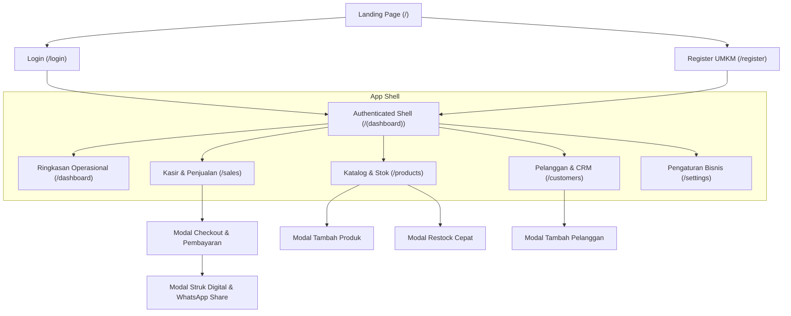
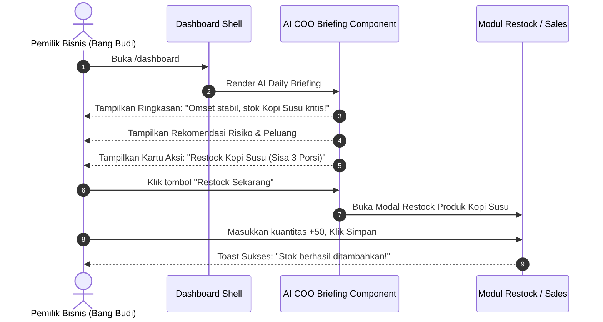
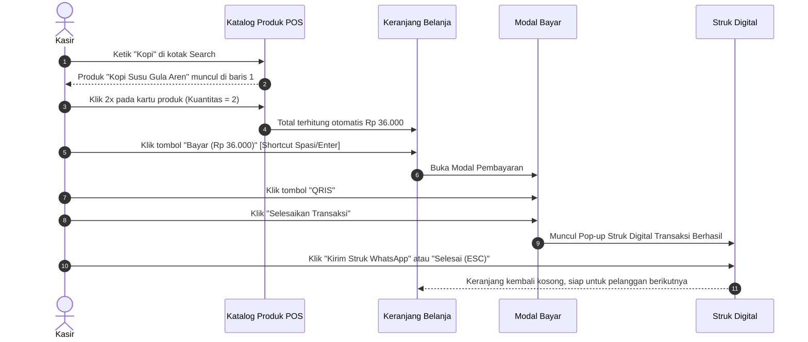

# Product Design & UX Specification Document
## AI COO — UI/UX Experience, User Journeys, and Screen Specifications

---

## 1. Filosofi Desain & Visi Antarmuka

**AI COO** mengusung filosofi desain: **"High-Velocity Utility with Executive Elegance"**.

UMKM di Indonesia sering kali harus memilih antara software kasir kuno yang kaku dan lambat, atau spreadsheet yang membingungkan. AI COO mengubah paradigma ini dengan menghadirkan:
1. **Dark Mode First (Slate-950)**: Mengurangi kelelahan mata operator kasir yang menatap layar berjam-jam di lingkungan kafe, toko kelontong, atau bengkel yang memiliki pencahayaan bervariasi.
2. **Ambient Glassmorphism & Depth**: Memadukan efek blur latar belakang (`backdrop-blur-xl`), gradien radial halus, dan batas tepi semi-transparan (`border-slate-800/80`) untuk memberikan kesan modern setara produk SaaS Silicon Valley.
3. **High-Velocity Micro-Interactions**: Semua aksi penting (tambah ke keranjang, ganti status stok, filter kategori) dieksekusi dengan feedback visual instan menggunakan **Framer Motion** tanpa reload halaman penuh.
4. **Indonesian Context & Ergonomics**: Tata letak dioptimalkan untuk perangkat layar sentuh (tablet kasir) dan smartphone pemilik toko yang sedang mobile. Format mata uang Rupiah dan tanggal Bahasa Indonesia menjadi standar mutlak.

---

## 2. Arsitektur Informasi & Peta Situs (*Sitemap*)

---

## 3. Alur Pengalaman Pengguna Inti (*Core User Journeys*)

### 3.1 Journey 1: Morning Briefing — Momen "Chief Operating Officer"
> **Skenario**: Pukul 07:00 WIB, Bang Budi membuka laptop/ponselnya sebelum warkop dibuka untuk mengecek arahan bisnis hari ini.

### 3.2 Journey 2: Peak Hours Fast Checkout — Transaksi 5 Detik Kasir
> **Skenario**: Jam sibuk makan siang, antrean kasir 5 orang. Kasir harus memproses pesanan secepat mungkin.

---

## 4. Spesifikasi Rinci Antarmuka & Layar (*Screen Specs*)

### 4.1 Layar Publik: Landing Page (`/`)
- **Tujuan**: Mengonversi pemilik UMKM Indonesia yang ragu menjadi pengguna aktif dalam waktu < 2 menit.
- **Elemen Visual**:
  - **Top Banner**: Badge mengambang bertuliskan *"Platform Operasional No. 1 Berbasis AI untuk UMKM Indonesia"* dengan ambient glow amber.
  - **Hero Headline**: *"Bukan Sekadar Aplikasi Kasir. Ini Asisten Direktur Operasional (COO) Pintar Bisnis Anda."*
  - **Live Preview Mockup**: Simulasi interaktif dashboard operasional dengan grafik tren mingguan dan kartu AI brief.
  - **Feature Showcase**: 3 pilar: (1) Kasir Kilat & Struk WhatsApp, (2) Deteksi Kebocoran Stok Otomatis, (3) Analisis Harian Bahasa Indonesia.
  - **Social Proof / Testimonial**: Testimoni pemilik usaha nyata (Warkop, Bengkel, Toko Kelontong).
  - **Sticky Bottom CTA**: Tombol *"Mulai Bisnis Anda Sekarang — Gratis"* menuju `/register`.

### 4.2 Layar Autentikasi: Pendaftaran UMKM (`/register`) & Login (`/login`)
- **Layout**: Centered card modern dengan background radial ambient glow `from-amber-500/10`.
- **Form Pendaftaran**:
  - Nama Pemilik (Input teks).
  - Email Bisnis (Input email dengan validasi RFC format).
  - Password (Input aman, minimal 6 karakter).
  - Nama Usaha / Perusahaan (e.g. *"Kopi Kenangan Senja"*).
  - Kategori Bisnis (`BusinessType` select dropdown: Warkop, Ritel, Laundry, Bengkel, Toko Bangunan, Distributor, Lainnya).
- **Keamanan Visual**: Pesan peringatan real-time jika ada field yang belum memenuhi syarat validasi Zod.

### 4.3 Shell Aplikasi Dashboard (`/(dashboard)`)
- **Sidebar Navigasi (Desktop)**:
  - Logo AI COO dengan icon `Brain` menyala amber.
  - Label status entitas bisnis saat ini (Nama Perusahaan & Badge Kategori).
  - Menu Navigasi:
    1. **Ringkasan**: Icon `TrendingUp`
    2. **Kasir POS**: Icon `ShoppingBag` (disertai indikator badge keranjang)
    3. **Produk & Stok**: Icon `Package` (disertai indikator merah jika ada stok kritis)
    4. **Pelanggan**: Icon `Users`
    5. **Pengaturan**: Icon `Store`
  - Footer Profil Pengguna: Avatar inisial, email pemilik, dan tombol Logout instan.
- **Header & Mobile Drawer**:
  - Tombol hamburger responsif untuk membuka navigation drawer pada layar tablet/ponsel.
  - Quick action shortcut dan status koneksi API.

### 4.4 Layar Dashboard Eksekutif (`/dashboard`)
- **Kartu Metrik KPI (Grid 4 Kolom)**:
  - *Total Omset*: Nilai Rupiah besar, persentase perubahan vs minggu lalu, glow amber.
  - *Transaksi Hari Ini*: Jumlah struk sukses hari ini, glow emerald.
  - *Pelanggan Terdaftar*: Jumlah database CRM, glow blue.
  - *Peringatan Stok*: Jumlah item butuh restock, glow red (berkedip jika > 0).
- **Grafik Tren Pendapatan 7 Hari (Custom SVG Vector Canvas)**:
  - Area chart dengan gradien linear vertikal amber (`stopColor="#f59e0b" stopOpacity="0.3"`).
  - Titik interaktif (*interactive hover nodes*) yang menampilkan tooltip melayang berisi rincian tanggal, omset, dan jumlah transaksi harian.
- **Section AI COO Daily Briefing**:
  - Banner gradient card `bg-linear-to-r from-amber-500/10 via-orange-500/5 to-transparent` dengan border `border-amber-500/30`.
  - Icon Brain berputar dengan badge *"Analisis Pukul 06:00 WIB"*.
  - Ringkasan eksekutif 2-3 kalimat.
  - Tab Evaluasi: **Potensi Risiko Operasional** (Icon `ShieldAlert`) dan **Peluang Cuan Hari Ini** (Icon `Zap`).
  - **Daftar Rencana Tindakan Taktis**: Kartu mikro yang berisi tombol aksi satu klik.

### 4.5 Layar Kasir & Transaksi POS (`/sales`)
- **Layout Split Screen (Desktop)**:
  - **Sisi Kiri (65%) — Katalog & Pencarian**:
    - Kolom live search dengan debounce.
    - Grid kartu produk yang menampilkan: Nama barang, SKU, harga Rupiah, dan pill sisa stok.
    - Status visual: Kartu berubah semi-transparan dengan label *"Stok Habis"* jika kuantitas = 0.
  - **Sisi Kanan (35%) — Keranjang Belanja & Panel Pembayaran**:
    - Dropdown pemilihan pelanggan (Walk-in vs Pelanggan CRM).
    - Daftar baris keranjang belanja dengan kontrol `+` / `-` kuantitas dan tombol hapus item.
    - Ringkasan kalkulasi: Subtotal, Diskon, dan Grand Total besar.
    - Tombol utama *"Proses Pembayaran"* (Lebar penuh, warna amber mencolok).
- **Modal Pembayaran**:
  - Pemilihan Metode: `Tunai`, `QRIS`, `Transfer`.
  - Tombol pecahan uang cepat untuk Tunai: *Uang Pas*, *Rp 50.000*, *Rp 100.000*, *Rp 200.000*.
  - Kalkulasi uang kembalian (*Change Amount*) berwarna hijau besar.
  - Catatan transaksi opsional.
- **Modal Struk Digital**:
  - Desain menyerupai struk kertas kasir mini (*thermal paper style*) dengan latar gelap.
  - Rincian item, subtotal, metode bayar, dan nominal kembalian.
  - Tombol aksi: *"Cetak Struk"* (window.print) dan *"Kirim ke WhatsApp Pelanggan"* (membuka `wa.me` dengan teks invoice rapi).

### 4.6 Layar Katalog Produk & Inventaris (`/products`)
- **Filter Tabs**: *Semua Produk*, *Kritis (≤5)*, *Menipis*, *Aman*.
- **Tabel / Grid Katalog**:
  - Kolom: Nama Produk & SKU, Kategori, Harga Jual, Stok Saat Ini, Ambang Minimum, dan Status.
  - Badges:
    - `Aman`: Hijau lembut (`bg-emerald-500/10 text-emerald-400`).
    - `Menipis`: Kuning amber (`bg-amber-500/10 text-amber-400`).
    - `Kritis (≤5)`: Merah menyala (`bg-red-500/10 text-red-400`).
  - Tombol Cepat: *"Restock"* (membuka modal input kuantitas tambahan) dan *"Hapus"* (soft delete konfirmasi).

### 4.7 Layar CRM Pelanggan (`/customers`)
- **Header Summary**: Total Pelanggan, Total Pelanggan VIP, Total Retensi.
- **Daftar Pelanggan**:
  - Nama, Nomor WhatsApp, Email, Tanggal Terakhir Belanja.
  - Badge Tier:
    - **VIP**: Mahkota Emas (`bg-purple-500/10 border-purple-500/20 text-purple-400`).
    - **Loyal**: Bintang Biru (`bg-blue-500/10 border-blue-500/20 text-blue-400`).
    - **Reguler**: Netral Slate.
  - Quick action: Klik nomor telepon langsung membuka chat WhatsApp untuk follow up atau ucapan terima kasih.

### 4.8 Layar Pengaturan Bisnis (`/settings`)
- Form pembaruan profil perusahaan: Nama Toko, Kategori Usaha, Alamat Fisik, dan Nomor Kontak Resmi.
- Informasi Akun Pengguna: Nama lengkap, email login, dan role pengguna.
- Kartu Diagnostik Sistem: Informasi status database, engine cache, versi software, dan timezone operasional (Asia/Jakarta).

---

## 5. Pola Interaksi & Feedback Visual

| Jenis Aksi | Komponen Feedback | Perilaku & Animasi |
| :--- | :--- | :--- |
| **Simpan Data Sukses** | `Sonner Toast` | Muncul dari kanan bawah: background slate-900 dengan icon hijau `CheckCircle2`. |
| **Validasi Gagal / Error** | `Sonner Toast` | Latar merah gelap dengan icon `AlertCircle` dan pesan berbahasa Indonesia lugas. |
| **Loading Mutasi Server** | `Button Spinner` | Tombol berubah disabled, teks digantikan oleh spinner berputar tanpa pergeseran layout (*layout shift*). |
| **Transisi Antar Halaman** | `Framer Motion` | Animasi fade-in-up halus: `initial={{ opacity: 0, y: 15 }} animate={{ opacity: 1, y: 0 }} transition={{ duration: 0.25 }}`. |
| **Buka Modal Dialog** | `Backdrop Blur Overlay` | Latar belakang meredup dengan blur `backdrop-blur-md`, modal meluncur halus dari posisi scale 0.95 ke 1.0. |

---

## 6. Standar Aksesibilitas & Ergonomi Kasir
- **Target Sentuh Minimum (*Touch Targets*)**: Seluruh tombol utama, tombol pecahan kasir, dan baris keranjang memiliki tinggi minimal 44px agar akurat ditekan di layar sentuh tablet/smartphone.
- **Kontras Teks Tinggi**: Rasio kontras teks utama (`slate-100` pada `slate-950`) melebihi standar WCAG AAA (> 7:1).
- **Penanganan Nilai Nol & Kosong (*Empty States*)**: Setiap daftar yang kosong menyediakan ilustrasi visual informatif dan tombol Call-To-Action (misal: *"Belum ada produk? Tambah produk pertamamu sekarang"*).
