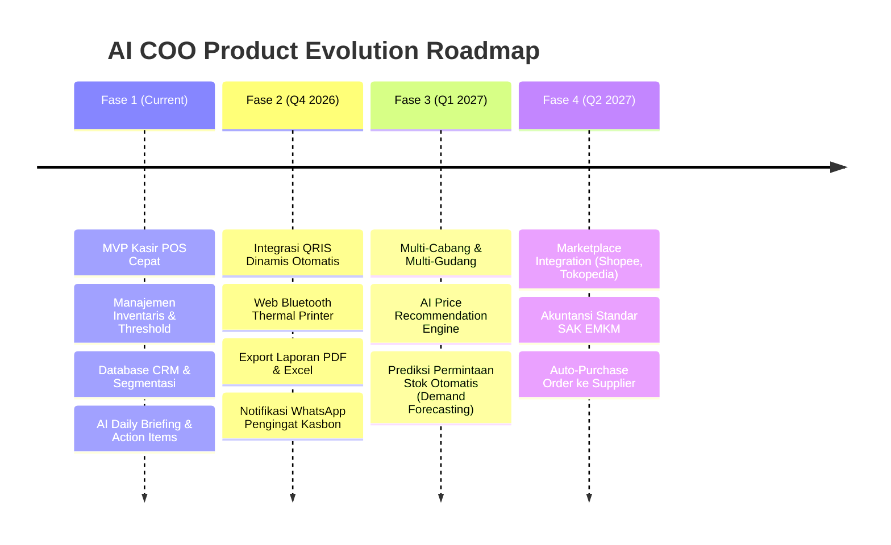

# Product Requirements Document (PRD)
## AI COO — Asisten Chief Operating Officer Berbasis AI untuk UMKM Indonesia

---

## 1. Executive Summary & Visi Produk

### 1.1 Visi
**AI COO** adalah platform operasional cerdas yang dirancang khusus untuk mentransformasi cara Usaha Mikro, Kecil, dan Menengah (UMKM) di Indonesia mengelola bisnis sehari-hari. Dengan menggabungkan kemudahan aplikasi Kasir (Point of Sale), manajemen inventaris real-time, pencatatan pelanggan (CRM), dan **Otak Analisis Operasional bertenaga AI**, AI COO bertindak layaknya seorang Chief Operating Officer profesional yang mendampingi pemilik bisnis setiap saat dalam Bahasa Indonesia yang lugas, taktis, dan mudah dieksekusi.

### 1.2 Latar Belakang Masalah
Di Indonesia, lebih dari 64 juta UMKM menyumbang lebih dari 60% PDB nasional, namun sebagian besar masih menghadapi tantangan fundamental:
1. **Buta Data Operasional (*Data Blindness*)**: Pemilik usaha memiliki catatan penjualan manual atau spreadsheet terpisah, tetapi tidak mengetahui produk mana yang sebenarnya menghasilkan laba bersih terbesar atau perputaran barang (*inventory turnover*) tercepat.
2. **Keterlambatan Restock (*Stockout vs Deadstock*)**: Pemilik terlambat menyadari barang laris telah habis, atau sebaliknya, modal kerja tertahan pada barang yang tidak bergerak selama berbulan-bulan.
3. **Hubungan Pelanggan Transaksional**: Sulit mengidentifikasi pelanggan loyal (*VIP*) dan tidak memiliki strategi retensi atau program loyalitas yang terukur.
4. **Keputusan Berdasarkan Intuisi Semata**: Pemilik UMKM tidak memiliki dana untuk mempekerjakan manajer operasional atau konsultan bisnis profesional untuk memberikan analisis performa harian dan rencana aksi.

### 1.3 Solusi AI COO
AI COO menyatukan sistem pencatatan transaksi kasir harian dengan analitik operasional otomatis. Setiap pagi pukul 06:00 WIB, AI COO memproses seluruh transaksi, status stok, dan data pelanggan untuk menyajikan:
- **Daily Executive Briefing**: Ringkasan performa 24 jam terakhir dalam bahasa Indonesia bisnis praktis.
- **Peringatan Risiko Dini (*Risk Warnings*)**: Deteksi stok kritis, penurunan omset drastis, atau margin tipis.
- **Peluang Ekspansi (*Opportunities*)**: Rekomendasi bundling produk, promosi ke segmen pelanggan spesifik, atau penyesuaian harga.
- **Rencana Tindakan Taktis (*Actionable Items*)**: Tombol aksi langsung (cth: "Restock Sekarang" atau "Hubungi Pelanggan via WhatsApp").

---

## 2. Target Pengguna & Persona

| Persona | Profil & Karakteristik | Pain Point Utama | Nilai yang Ditawarkan AI COO |
| :--- | :--- | :--- | :--- |
| **Bang Budi** *(Owner Warkop Modern & Kafe)* | Pemilik kafe usia 32 tahun, 4 karyawan, transaksi harian 120–250 struk. Sangat mobile dan sering tidak di toko. | Sering kehabisan biji kopi & susu UHT saat jam sibuk malam hari; pencatatan kasbon pelanggan sering hilang. | Kasir cepat dengan opsi QRIS/Tunai, notifikasi stok kritis otomatis, pemantauan omset real-time dari HP. |
| **Bu Siti** *(Owner Toko Kelontong & Sembako)* | Pemilik toko ritel sembako usia 48 tahun, ribuan SKU barang, perputaran barang cepat tapi margin tipis. | Sulit mengingat harga modal vs harga jual puluhan distributor; barang kadaluarsa atau menumpuk di gudang belakang. | Manajemen inventaris dengan threshold minimum, peringatan deadstock, deteksi pelanggan grosir loyal. |
| **Mas Deni** *(Owner Jasa Laundry Kiloan & Satuan)* | Pemilik 2 cabang laundry, mengelola pelanggan langganan bulanan dan komplain ketepatan waktu. | Bingung membedakan pelanggan baru vs pelanggan langganan yang sudah spending jutaan rupiah. | CRM pelanggan otomatis dengan tier VIP & Loyal, riwayat transaksi lengkap, ringkasan pendapatan mingguan. |

---

## 3. Sasaran Strategis & Metrik Keberhasilan (KPIs/OKRs)

| Dimensi | Metrik / Indikator | Target Milestone V1 |
| :--- | :--- | :--- |
| **Adopsi Pengguna** | Waktu rata-rata transaksi kasir (*checkout time*) | < 5 detik per transaksi |
| **Engagement AI** | Interaksi pemilik membaca Daily Brief & klik Action Items | > 70% aktif setiap minggu |
| **Efisiensi Stok** | Penurunan insiden kehabisan stok (*stockout incident*) | Berkurang hingga 40% dalam 30 hari |
| **Integritas Sistem** | Kecepatan respons API (*P95 Latency*) | < 200 ms untuk transaksi POS |
| **Ketersediaan** | System Uptime & SLA pipeline harian | 99.9% uptime |

---

## 4. Ruang Lingkup Produk (*Product Scope*)

### 4.1 In-Scope (Fitur Rilis V1)
1. **Multi-Tenant Authentication & Company Management**:
   - Pendaftaran entitas bisnis (`Company`) dengan tipe usaha (`WARKOP`, `TOKO_BANGUNAN`, `LAUNDRY`, `BENGKEL`, `RETAIL`, `DISTRIBUTOR`, `OTHER`).
   - Akun pengguna ber-role (`OWNER`, `STAFF`) dengan token JWT terenkripsi dan isolasi tenant ketat.
2. **Point of Sale (POS) & Kasir Cepat**:
   - Pemilihan pelanggan (walk-in atau pelanggan terdaftar).
   - Keranjang belanja dinamis, kalkulasi diskon, subtotal, dan total.
   - Metode pembayaran lengkap: Tunai (`CASH`), `QRIS`, Transfer Bank (`TRANSFER`), dan Kasbon (`KASBON`).
   - Kalkulator pecahan uang otomatis (*Quick Cash denominations*) dan kalkulasi uang kembalian.
   - Cetak struk digital simulasi dan share invoice instan ke WhatsApp.
3. **Manajemen Inventaris & Stok**:
   - Katalog produk lengkap dengan SKU, kategori, harga jual, dan stok saat ini.
   - Ambang batas stok minimum (*Min Stock Level*).
   - Status badge otomatis: **Aman**, **Menipis**, dan **Kritis (≤5)**.
   - Modal Restock Cepat tanpa perlu menghapus atau membuat ulang produk.
   - Pengurangan stok otomatis secara atomik (*Prisma Transaction*) saat transaksi penjualan berhasil.
4. **Customer Relationship Management (CRM)**:
   - Database pelanggan (Nama, Telepon, Email, Alamat).
   - Akumulasi pengeluaran seumur hidup (*Total Spent*) dan tanggal transaksi terakhir (*Last Purchase At*).
   - Segmentasi pelanggan otomatis: **Pelanggan VIP** (≥ Rp 500.000), **Pelanggan Loyal** (≥ Rp 200.000), dan **Pelanggan Baru**.
5. **Dashboard Eksekutif & Visualisasi Tren**:
   - Kartu metrik utama: Total Omset, Transaksi Hari Ini, Pelanggan Terdaftar, dan Peringatan Stok.
   - Grafik SVG interaktif tren pendapatan 7 hari dengan hover data point real-time.
6. **Otak Analisis Operasional (AI Chief Operating Officer)**:
   - Analisis otomatis metrik bisnis lokal (Revenue Trend, Margin, Customer Churn Risk, Fast-moving Product).
   - Generasi analisis harian menggunakan LLM (OpenAI GPT-4o-mini) dengan format `json_schema` terstruktur.
   - Pipeline background worker terjadwal menggunakan Redis BullMQ (pukul 06:00 WIB).
   - Mekanisme *Multi-Tier Resiliency Fallback* saat API eksternal atau Redis offline.

### 4.2 Out-of-Scope (Rencana Fase Selanjutnya)
- Integrasi Payment Gateway otomatis (Midtrans/Xendit) untuk auto-settlement QRIS dinamis.
- Integrasi hardware printer thermal Bluetooth secara native melalui Web Bluetooth API.
- Manajemen multi-cabang (*Multi-Outlet / Multi-Warehouse*) di bawah satu Company.
- Integrasi modul perpajakan Indonesia (e-Faktur / PPN 11%).

---

## 5. Kebutuhan Fungsional Rinci (*Functional Requirements*)

### 5.1 Modul Autentikasi & Organisasi (FR-AUTH)
- **FR-AUTH-01**: Pengguna baru dapat mendaftar dengan menginput: Nama Lengkap, Email, Password, Nama Perusahaan/Usaha, dan Kategori Usaha (`BusinessType`).
- **FR-AUTH-02**: Sistem membuat record `Company` dan akun `User` dengan role `OWNER` dalam satu transaksi atomik.
- **FR-AUTH-03**: Password wajib di-hash menggunakan algoritma Bcrypt (salt rounds 10).
- **FR-AUTH-04**: Pengguna yang berhasil login menerima token JWT yang disimpan pada cookie `httpOnly`, aman dari eksploitasi XSS.
- **FR-AUTH-05**: Setiap request ke API divalidasi oleh `JwtAuthGuard` dan `TenantInterceptor` untuk memastikan isolasi tenant berbasis `companyId`.

### 5.2 Modul Point of Sale & Penjualan (FR-POS)
- **FR-POS-01**: Antarmuka kasir menyediakan pencarian produk secara instan berdasarkan nama atau SKU.
- **FR-POS-02**: Kasir dapat menambahkan produk ke keranjang belanja dengan penyesuaian kuantitas secara real-time.
- **FR-POS-03**: Kasir dapat memilih pelanggan terdaftar atau default *Pelanggan Umum (Walk-in)*.
- **FR-POS-04**: Sistem menghitung total tagihan, menerima input nominal pembayaran, dan menampilkan uang kembalian secara real-time.
- **FR-POS-05**: Sistem memvalidasi ketersediaan stok sebelum checkout. Jika stok tidak mencukupi, transaksi dibatalkan dengan pesan error yang jelas.
- **FR-POS-06**: Transaksi penjualan dieksekusi dalam database transaction:
  - Membuat record `Sale` dan `SaleItem`.
  - Mengurangi `stockQuantity` pada masing-masing `Product`.
  - Mengakumulasi `totalSpent` dan memperbarui `lastPurchaseAt` pada `Customer` yang bersangkutan.
- **FR-POS-07**: Setelah sukses, modal Struk Digital muncul dengan ringkasan transaksi, opsi cetak, dan tautan kirim pesan WhatsApp ke nomor telepon pelanggan.

### 5.3 Modul Katalog & Inventaris (FR-INV)
- **FR-INV-01**: Pemilik dapat menambahkan produk baru dengan atribut: Nama, SKU (opsional), Kategori, Harga Jual, Stok Awal, dan Batas Stok Minimum.
- **FR-INV-02**: Sistem mengelompokkan status stok produk ke dalam 3 level indikator visual:
  - **Aman**: Stok > Ambang Batas Minimum.
  - **Menipis**: Stok ≤ Ambang Batas Minimum (default 10).
  - **Kritis**: Stok ≤ 5 unit (indikator merah berkedip).
- **FR-INV-03**: Fitur filter cepat berdasarkan status stok: *Semua*, *Kritis (≤5)*, *Menipis*, dan *Aman*.
- **FR-INV-04**: Tindakan Restock Cepat: Pengguna dapat menambah kuantitas stok tanpa mengubah parameter produk lainnya.
- **FR-INV-05**: Soft Delete: Penghapusan produk mengisi timestamp `deletedAt` tanpa merusak riwayat transaksi pada tabel `sale_items`.

### 5.4 Modul Pelanggan & CRM (FR-CRM)
- **FR-CRM-01**: Pendaftaran pelanggan dengan Nama, Nomor HP/WhatsApp, Email, dan Alamat.
- **FR-CRM-02**: Sistem memformat nomor telepon Indonesia secara otomatis (misal `0812...` menjadi `62812...`) untuk integrasi tautan WhatsApp.
- **FR-CRM-03**: Pemberian badge tier otomatis:
  - **VIP**: Total belanja ≥ Rp 500.000 (Icon Mahkota Emas).
  - **Loyal**: Total belanja ≥ Rp 200.000 (Icon Bintang Biru).
  - **Reguler**: Total belanja < Rp 200.000.
- **FR-CRM-04**: Riwayat transaksi pelanggan dapat dilihat untuk menganalisis frekuensi kunjungan dan churn rate.

### 5.5 Modul AI Chief Operating Officer (FR-AI)
- **FR-AI-01**: Engine analitik mengumpulkan metrik terverifikasi dari database:
  - Tren pendapatan 7 hari terakhir vs 7 hari sebelumnya.
  - Nilai rata-rata per transaksi (*Average Order Value*).
  - Produk terlaris berdasarkan kuantitas penjualan 30 hari terakhir.
  - Daftar produk dengan stok kritis.
  - Jumlah pelanggan yang berisiko churn (>30 hari tidak berbelanja).
- **FR-AI-02**: Sistem mengonstruksi prompt analisis operasional UMKM Indonesia dan mengirimkannya ke LLM menggunakan format JSON Schema yang divalidasi Zod.
- **FR-AI-03**: Struktur output AI wajib memuat:
  - `summary`: Ringkasan kondisi operasional bisnis saat ini (maks. 3 kalimat).
  - `risks`: Daftar 2-3 risiko paling mendesak yang membutuhkan mitigasi.
  - `opportunities`: Daftar 2-3 peluang peningkatan omset atau efisiensi modal.
  - `action_items`: Daftar tindakan konkret dengan `target_type` (`PRODUCT` / `CUSTOMER`), `target_name`, `action`, dan `reason`.
- **FR-AI-04**: Hasil analisis disimpan pada cache Redis (TTL 24 jam) dan dicatat permanen di tabel `insights`.
- **FR-AI-05**: Background job BullMQ dijadwalkan setiap hari pukul 06:00 WIB untuk menghasilkan insight baru bagi seluruh tenant terdaftar.
- **FR-AI-06**: Jika layanan AI eksternal atau Redis mengalami gangguan, sistem secara transparan menyajikan fallback cerdas dengan bendera `isStale: true` tanpa memicu error 500.

---

## 6. Kebutuhan Non-Fungsional (*Non-Functional Requirements*)

### 6.1 Performa (*Performance*)
- Waktu muat halaman pertama (*First Contentful Paint*) < 1.2 detik pada koneksi 4G standar.
- Eksekusi transaksi POS dan pembuatan struk selesai dalam waktu < 200 milidetik.
- Respons pembacaan dashboard menggunakan data ter-cache < 80 milidetik.

### 6.2 Keamanan & Privasi (*Security & Tenant Isolation*)
- **Zero Cross-Tenant Leakage**: Seluruh query Prisma diwajibkan mencakup klausul `where: { companyId }`.
- Enkripsi password menggunakan Bcrypt dengan work factor yang memadai.
- Proteksi API menyeluruh dengan **Helmet** (HTTP security headers) dan **CORS** terbatas pada domain web frontend.
- Validasi input ketat di level API menggunakan **Zod Validation Pipe** untuk mencegah SQL Injection, NoSQL Injection, atau payload manipulatif.

### 6.3 Desain & Aksesibilitas (*UI/UX & Localization*)
- Tampilan bertema Dark Mode Premium (Slate-950) untuk mengurangi kelelahan mata operator kasir yang bekerja berjam-jam.
- Seluruh nilai moneter diformat dalam standar Rupiah Indonesia (e.g. `Rp 150.000`).
- Format tanggal dan nama hari menggunakan standar Bahasa Indonesia (e.g. `Senin, 08 Sep`).
- Antarmuka responsif penuh (*mobile-first* dan desktop-optimized) dengan sidebar navigasi yang dapat dilipat.

---

## 7. Penanganan Kasus Khusus & Kegagalan (*Edge Cases & Fallbacks*)

| Skenario | Dampak Potensial | Strategi Penanganan Sistem |
| :--- | :--- | :--- |
| **OpenAI API Timeout / Kuota Habis** | Gagal menghasilkan insight operasional harian. | Sistem menangkap error, mencoba retry 2x, lalu mengambil insight terakhir dari database lokal atau mengembalikan default briefing dengan badge status `isStale: true`. |
| **Redis Server Mati** | BullMQ tidak bisa memproses job antrean; caching tidak tersedia. | API tetap melayani transaksi POS dan CRUD produk/pelanggan secara normal; modul insight langsung membaca data dari database PostgreSQL. |
| **Stok Barang Menjadi 0 Saat Transaksi Berjalan** | Dua kasir menjual barang terakhir secara bersamaan (*race condition*). | Transaksi menggunakan isolasi database Prisma `$transaction`. Request kedua akan menerima error validasi `Stok produk [Nama] tidak mencukupi`. |
| **Koneksi Internet Terputus Singkat di Kasir** | Form submit kasir macet. | Tombol submit dinonaktifkan dengan status loading spinner untuk mencegah double-charge; pesan toast error sonner menginfokan kegagalan transaksi. |

---

## 8. Roadmap Pengembangan Masa Depan

